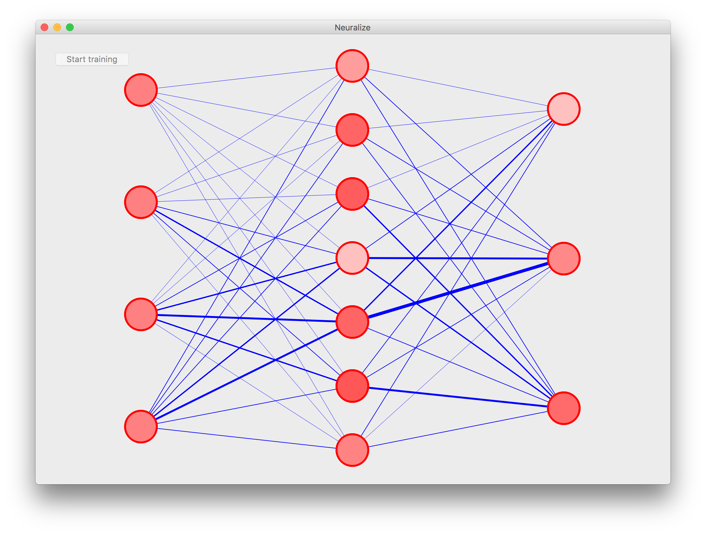

# Neuralize #

## Overview ##
Neuralize is a visualizer for fully-connected neural net training. It displays the progress of the training by depicted the weights and biases of the neural net's synapses and neurons. It uses PyQt as the graphical user interface.

## Engine ##
The visualizer uses a custom Neural Net class. This class implements a simple feed-forward neural net and a backpropagation algorithm that takes advantage of stochastic gradient descent. It is also dynamic, meaning it can be flexible with the number of layers and the size of the layers. 

Using the Neural Net class, the visualizer can access weights and biases of the network. It creates synapses with a width that is proportional the the weight of the synapse and nodes with a transparency that is proportional to the bias of the neuron. 

## Usage ##
`python3 run_iris.py` runs the GUI with a neural net trained with the Iris dataset. Click "Start Training" to start the visualization.

Training a 4 Layer Neural Network with 7 hidden neurons with the Iris dataset.



## Training MNIST Data ##
To train a Neural Net object with the famous MNIST dataset, run
```bash
python3 run_mnist.py
```
Saving the trained network: `python3 run_mnist.py -s { filename }`

Loading a trained network: `python3 run_mnist.py -l { filename }`

Training a saved network: `python3 run_mnist.py -l { filename } -t { additional_iterations }`

Add the `-s` flag to save the new network.

## Comparing Neural Network Parameters ##
`compare.py` is an experimental Python3 script that compares the performance of a neural network based on its structure (number of layers, rate of learning, etc). 

## Future Work ##
* Optimize the Neural Net class